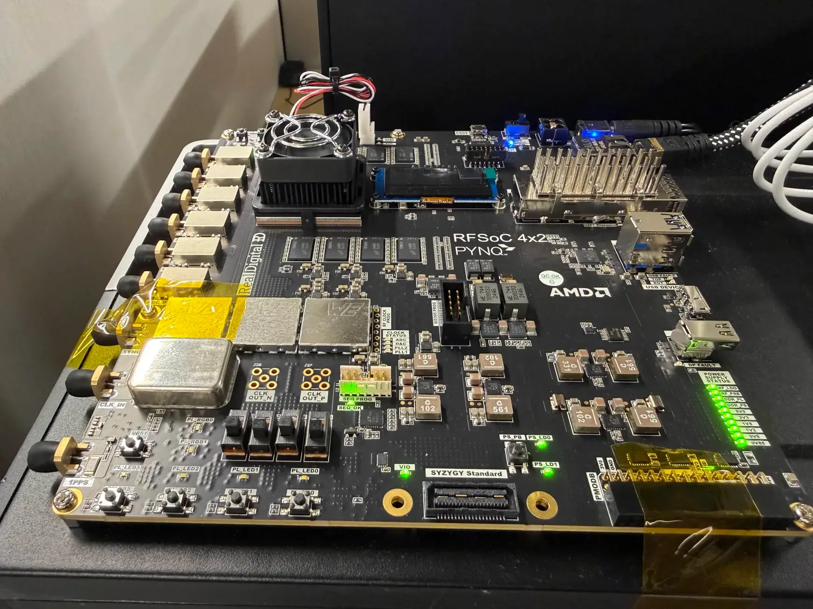
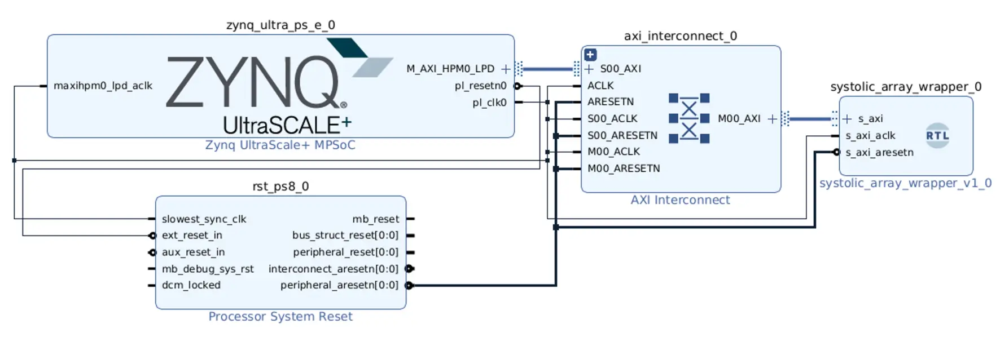
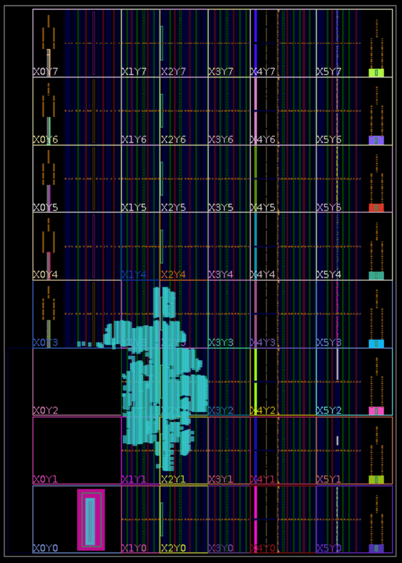
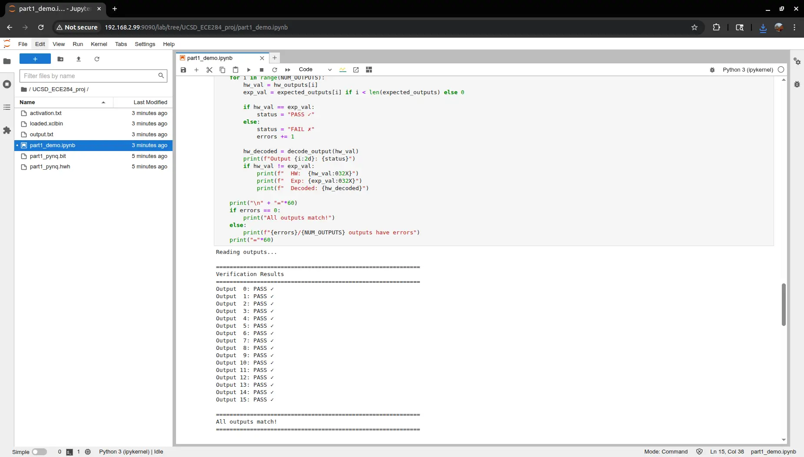

# Part 1 PYNQ Deployment for RFSoC 4x2

## Boards
We target the [RFSoC 4x2](https://www.amd.com/en/corporate/university-program/aup-boards/rfsoc4x2.html) board (part number `xczu48dr-ffvg1517-2-e`) for this deployment.

## Block Diagram
The block diagram for the Part 1 PYNQ deployment on the RFSoC 4x2 board using the AXI Lite interface is illustrated below:

## Implemented Design

## Interface with PYNQ
A working example showing the interfacing of the deployed design with PYNQ through a Jupyter Notebook is shown below:

## Prerequisites
- The files in the `/software/part1` directory
- Vivado 2022.1 or later
- PYNQ 3.0.1 or later image on the RFSoC 4x2 board

## Resource Utilization
| Resource | Utilization | Available | Utilization % |
| :--- | :--- | :--- | :--- |
| LUT | 8837 | 425280 | 2.08 |
| LUTRAM | 66 | 213600 | 0.03 |
| FF | 16525 | 850560 | 1.94 |
| BRAM | 4 | 1080 | 0.37 |
| URAM | 2 | 80 | 2.50 |
| BUFG | 2 | 696 | 0.29 |

## Power Consumption
### Power Analysis Summary

| Metric | Value |
| :--- | :--- |
| **Total On-Chip Power** | **1.203 W** |
| Junction Temperature | 26.0°C |
| Thermal Margin | 74.0°C |
| Confidence Level | Medium |

### Detailed Power Consumption Breakdown

| Type | Component | Power (W) | Percentage |
| :--- | :--- | :--- | :--- |
| **Dynamic** | **Total** | **0.724 W** | **60%** |
| | PS | 0.670 W | 92% |
| | Clocks | 0.027 W | 4% |
| | Signals | 0.010 W | 1% |
| | Logic | 0.009 W | 1% |
| | URAM | 0.005 W | 1% |
| | BRAM | 0.003 W | 1% |
| **Static** | **Total** | **0.479 W** | **40%** |
| | PL | 0.479 W | 100% |

## Clocks
### Clock Summary

| Name | Waveform | Period (ns) | Frequency (MHz) |
| :--- | :--- | :--- | :--- |
| clk_pl_0 | {0.000 5.156} | 10.312 | 96.974 |

### Timing Slack Summary

| Category | Worst Slack | Total Negative Slack | Failing Endpoints | Status |
| :--- | :--- | :--- | :--- | :--- |
| **Setup** | 5.277 ns | 0.000 ns | 0 | **Met** |
| **Hold** | 0.011 ns | 0.000 ns | 0 | **Met** |
| **Pulse Width** | 3.656 ns | 0.000 ns | 0 | **Met** |

As shown in the tables above, all timing constraints have been successfully met, and the design can increase the clock frequency to 200 MHz.

## Acknowledgments
This "+ alpha" work is assisted by Claude Code.
Some code borrowed from my own projects (by [Wuqiong Zhao](https://wqzhao.org)).
